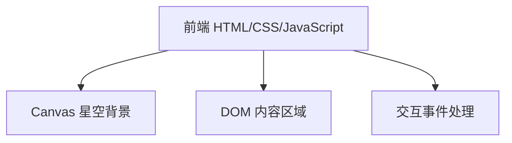

## 1. 架构设计

## 2. 技术描述
- 前端：纯 HTML + CSS + JavaScript（单页面，无需框架）
- 样式：Tailwind CSS v3 通过 CDN 引入
- 动画：CSS transitions + JavaScript requestAnimationFrame
- 无后端，无数据库，完全静态

## 3. 路由定义
| Route | Purpose |
|-------|---------|
| / | 宇宙星空单页网站 |

## 4. API定义
无后端API，所有功能在前端完成。

## 5. 数据模型
不适用，无持久化数据。
