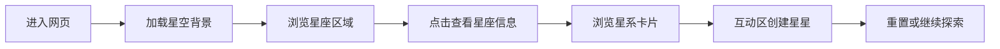

## 1. 产品概述
这是一个沉浸式宇宙星空主题单页网站，展示宇宙的浩瀚与美丽，为用户带来震撼的视觉体验。

- 主要目的：展示宇宙星空的视觉美感，提供交互式探索体验
- 目标用户：对天文、宇宙、美学感兴趣的所有用户

## 2. 核心功能

### 2.1 功能模块
1. **主页面**：动态星空背景、英雄区、星座展示区、星系浏览区、互动探索区

### 2.2 页面详情
| 页面名称 | 模块名称 | 功能描述 |
|-----------|-------------|---------------------|
| 主页面 | 动态星空背景 | 自动生成闪烁星星，带有视差滚动效果 |
| 主页面 | 英雄区域 | 展示主题标题和简短介绍，配有打字机动画效果 |
| 主页面 | 星座展示 | 展示主要星座，点击可显示星座名称和故事 |
| 主页面 | 星系浏览 | 卡片式展示著名星系，悬停有放大动画 |
| 主页面 | 互动探索 | 用户可以点击创建自己的星星，支持清空重置 |
| 主页面 | 页脚 | 相关链接和版权信息 |

## 3. 核心流程
用户打开网页 → 欣赏动态星空背景 → 滚动浏览不同区域 → 点击星座了解信息 → 悬停查看星系 → 在互动区点击创建星星

## 4. 用户界面设计

### 4.1 设计风格
- 主色调：深邃黑色 + 靛蓝色渐变作为背景，白色/淡黄色星星，青色/紫色高亮
- 辅助色：使用蓝紫色调展示星云效果，粉色点缀深空天体
- 按钮样式：圆角半透明，悬停发光效果
- 字体：使用Orbitron作为标题字体（未来科技感），Inter作为正文字体
- 布局风格：全屏沉浸式，分段滚动，居中对称布局
- 动画：星星闪烁、缓动入场、视差滚动、悬停放大

### 4.2 页面设计概述
| 页面名称 | 模块名称 | UI元素 |
|-----------|-------------|-------------|
| 主页面 | 动态星空背景 | Canvas绘制随机星星，自动闪烁，视差滚动效果 |
| 主页面 | 英雄区域 | 大标题，副标题，渐变文字，淡入动画 |
| 主页面 | 星座展示 | 交互式SVG连线，点击弹出信息卡 |
| 主页面 | 星系浏览 | 响应式卡片网格，悬停3D旋转效果 |
| 主页面 | 互动探索 | 点击画布创建星星，清空按钮 |

### 4.3 响应式
- 桌面优先设计，支持移动端自适应
- 移动端减少星星数量保证性能
- 触控友好的点击区域

### 4.4 3D场景指引 (不适用)
本项目使用Canvas 2D + CSS动画实现，不需要3D引擎。
